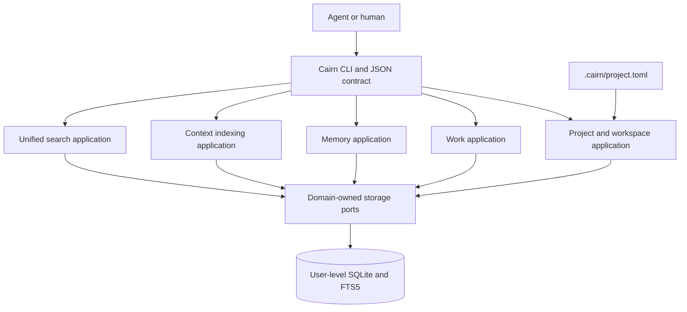

# Separate work, memory, and context behind one local platform

Cairn uses vertical domain boundaries with shared project identity, SQLite infrastructure, and a unified search projection. The domains remain separate even though they share one physical database.

## System shape



Domain and application code must not import `bun:sqlite`. SQLite stays behind infrastructure adapters.

## Project identity

Project identity is stable; directory paths are observations.

```text
Project UUID
  ├── workspace: /old/path/cairn
  ├── workspace: /new/path/cairn
  └── workspace: /another/git-worktree
```

Each repository contains a tracked `.cairn/project.toml` with a version, project UUID, and display name. Every command resolves that manifest and registers the current physical workspace path. Work and memory reference `project_id`; indexed files reference `workspace_id` plus relative path and content hash.

## Storage

The platform data directory follows operating-system conventions and can be overridden with `CAIRN_DATA_DIR`.

| Platform | Default |
| --- | --- |
| macOS | `~/Library/Application Support/Cairn` |
| Linux | `$XDG_DATA_HOME/cairn` or `~/.local/share/cairn` |
| Windows | `%LOCALAPPDATA%\Cairn` |

The current schema establishes:

- versioned migrations;
- projects and workspaces;
- a shared search projection and external-content FTS5 table;
- WAL mode, foreign keys, a busy timeout, and normal synchronization;
- restricted database and data-directory permissions where supported.

Planned migrations add separate work, memory, context-source, audit, and import tables.

## Domain boundaries

| Domain | Owns |
| --- | --- |
| Project | Identity, manifests, workspace registration, scopes |
| Work | Work items, dependencies, comments, status, history |
| Memory | Sessions, memories, topics, relations, chronology |
| Context | Sources, document versions, hashes, index policy |
| Search | Read-only projection across typed domain records |
| Operations | Migrations, backup, restore, integrity, import/export |

Do not introduce a generic writable `items` table. Unified search is a projection, not the source model.

## Current executable slice

The first slice implements:

1. Platform data-directory resolution
2. Runtime-validated TOML project manifests
3. Git-root discovery
4. SQLite schema migration
5. Rename-safe project/workspace registration
6. `init`, `status`, `doctor`, `--help`, and `--version`
7. Human-readable and JSON output
8. Strict type checking, unit/integration tests, and standalone compilation
9. Work-item capture, project-isolated lookup, deterministic listing, audit creation, and search projection

## Next vertical slices

1. Work lifecycle and ready/blocked dependency queries
2. Durable memory capture, topics, context, and timelines
3. Incremental source indexing and FTS search
4. Unified typed search projection
5. Beads and Engram migration
6. Backup, restore, release packaging, and Homebrew bottles

## Quality rules

| Attribute | Evidence |
| --- | --- |
| Determinism | Stable query ordering and concrete fixtures |
| Durability | Transaction, restart, and interrupted-write tests |
| Isolation | Project, workspace, and scope boundary tests |
| Explainability | Provenance and match metadata in results |
| Portability | Native CI and compiled-binary smoke tests |
| Evolvability | Ordered migrations and domain-owned ports |
| Scriptability | Versioned JSON contracts and exit codes |
