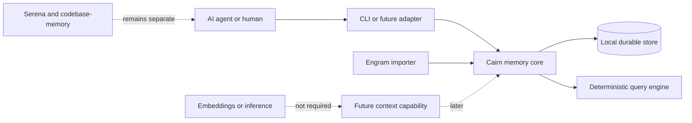

# Keep the memory core independent from interfaces and infrastructure

Cairn should begin as a small ports-and-adapters system organized around complete memory workflows. This direction preserves the accepted deterministic core while leaving runtime, database, and interface technologies replaceable.

The architecture below is **proposed**, except for the accepted system boundaries called out explicitly.

## System boundary



### Accepted boundaries

- Core capture and retrieval cannot require embeddings, inference, or network access.
- Durable memory is the first product boundary.
- Broader project context is a later phase.
- Serena and codebase-memory remain separate code-intelligence tools.

## Current stack transition

| Current component | Current responsibility | Cairn direction |
| --- | --- | --- |
| Engram | Durable observations, topics, scopes, timelines, and session summaries | Primary Phase 1 behavior and migration source |
| `agents-context` | Fast broad retrieval across local sources | Deferred context capability; not part of the first core |
| LightRAG | Curated relationship and graph synthesis | Not a core dependency; reconsider only after deterministic memory succeeds |
| `agents-rag` | Legacy SQLite RAG fallback | No direct replacement commitment in Phase 1 |
| Ollama | Embedding and inference infrastructure | Must not be required for core Cairn workflows |
| Serena | Language-server code navigation and refactoring | Out of scope |
| codebase-memory | Persistent code graph and impact analysis | Out of scope |

## Proposed logical architecture

```text
Interfaces
  CLI commands and stable JSON contracts
        |
Application
  SaveMemory, GetMemory, SearchMemories, ShowTimeline, ImportMemories
        |
Domain
  MemoryRecord, Scope, Topic, MemoryType, Query, Provenance
        |
Ports
  MemoryRepository, SearchIndex, Clock, IdGenerator, ImportSource
        |
Adapters
  Local persistence, deterministic text index, Engram import, console output
```

Dependencies point inward: interfaces and adapters depend on application and domain contracts. The domain does not know which database, runtime, or CLI framework is selected.

## Proposed domain vocabulary

| Concept | Responsibility |
| --- | --- |
| Memory record | An immutable durable observation with stable identity and provenance |
| Scope | Separates personal memory from project-specific memory |
| Project key | Identifies the project boundary without depending only on the current path |
| Topic | Connects evolving observations about one durable subject |
| Memory type | Classifies intent such as decision, discovery, bug fix, or session summary |
| Query | Expresses filters, text terms, ordering, and limits deterministically |
| Provenance | Records who or what created/imported the memory and from where |

Whether records are strictly immutable or allow controlled revision is still open. The persistence model must not decide that policy accidentally.

## First walking skeleton

Build one end-to-end behavior before adding the full command set:

1. Create a structured memory through the CLI.
2. Validate it in the domain.
3. Persist it through a repository port.
4. Retrieve it by stable ID and exact project/topic filters.
5. Return both human-readable and JSON representations.
6. Restart the process and prove the same record is still available.

This slice proves the command boundary, domain model, persistence contract, serialization contract, and test strategy without requiring relevance ranking or migration complexity.

## Query behavior

Phase 1 search should be explainable and testable. A proposed order of capability is:

1. Exact identity lookup
2. Exact scope, project, topic, and type filters
3. Time-range filtering and timeline neighbors
4. Deterministic lexical text search
5. Documented ranking and tie-breaking

Every search result should be able to report which filters and text terms matched. Optional semantic retrieval, if ever introduced, belongs behind a separate adapter and cannot redefine core correctness.

## Quality attributes

| Attribute | Required evidence |
| --- | --- |
| Determinism | Repeatable query fixtures with stable ordering |
| Durability | Restart and interrupted-write integration tests |
| Isolation | Cross-project and personal/project scope tests |
| Explainability | Match metadata and provenance in query results |
| Portability | Clean setup on a machine without Ollama or network access |
| Evolvability | Versioned schemas and migration tests |
| Scriptability | Stable JSON contracts and exit codes |

## Architecture decision gates

Before implementation, record ADRs for:

1. Language and runtime
2. Persistence engine and transaction model
3. Record mutability and topic evolution
4. Project identity rules
5. Query grammar, ranking, and tie-breaking
6. CLI and JSON compatibility contract
7. Engram migration strategy
8. Secret handling, redaction, and backup policy
